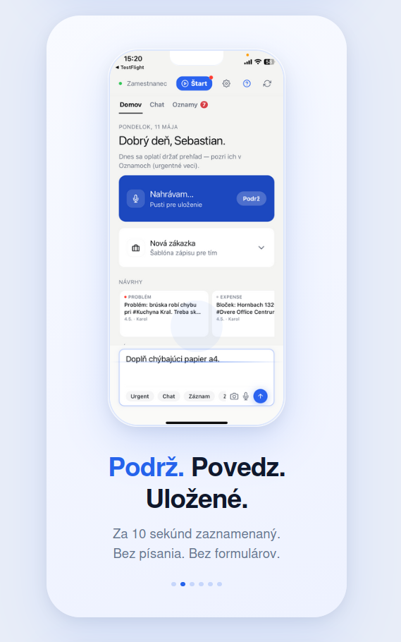
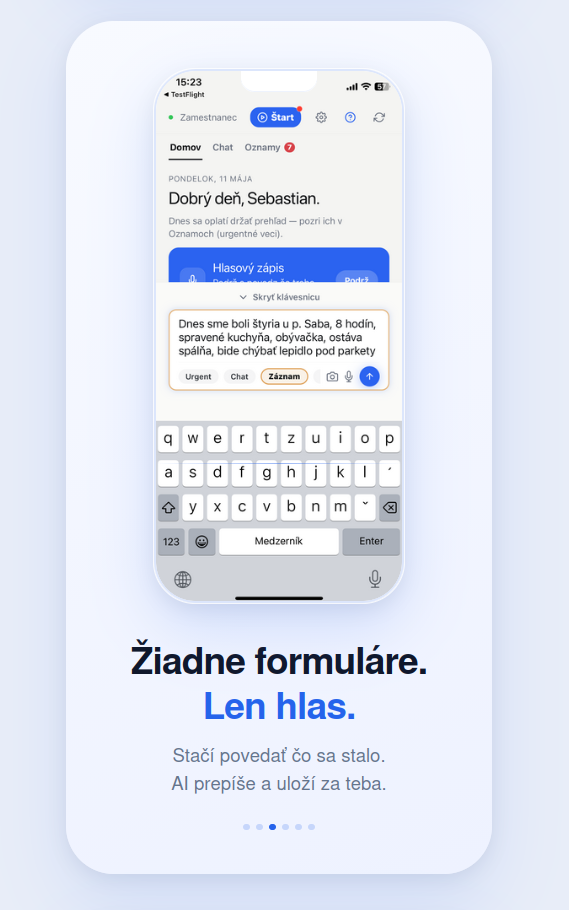
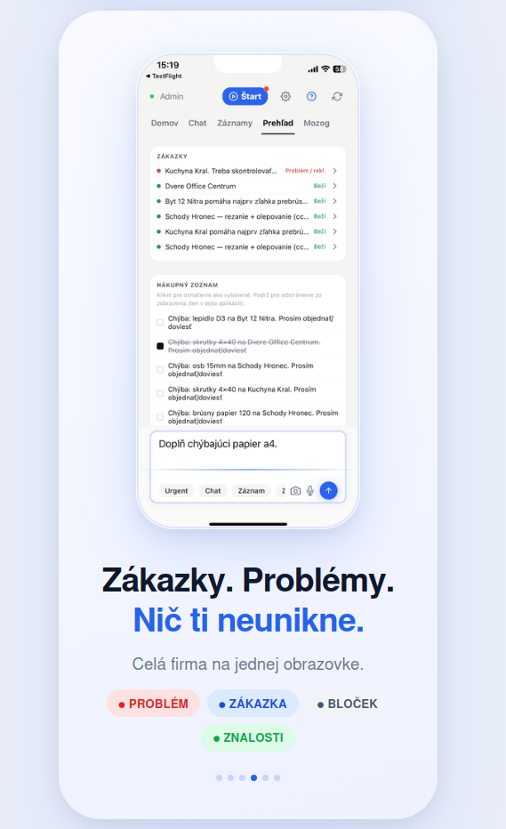
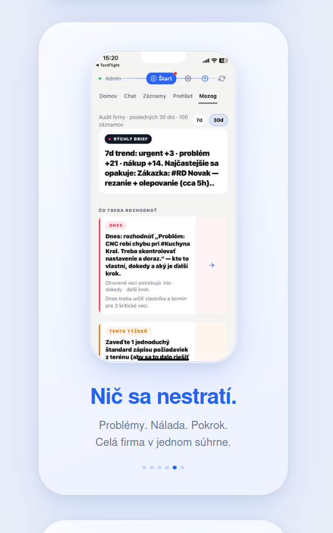

# NUMchat Business — Self-hosted AI Knowledge Base for SMBs

> Firemný mozog — AI which knows everything your company knows.  
> Voice input. Photo capture. Offline-first. All data stays on your server.

[](https://expo.dev)
[](https://reactnative.dev)
[](https://www.typescriptlang.org)
[](https://huggingface.co/Qwen)
[](https://github.com/gusye1234/mini_rag)
[](https://github.com/sebastian414/numchat-business-demo)

> **Note:** This is a UI demo repository. Full source is private (commercial product, self-hosted B2B).  
> Shown here: screen designs + extracted utility module as a representative code sample.

---

## Screenshots

<div align="center">
  
  
  
  
</div>

---

## What it does

FirmaMozog is an internal knowledge management system for Slovak SMBs where employees record what's happening in the company by voice — in 10 seconds, without forms.

**Core loop:**
1. **Hold** the record button → **Speak** what happened → **Saved**
2. AI classifies the entry (problem / missing material / task done / knowledge / expense)
3. Manager sees a structured dashboard: open issues, shopping list, project status
4. **Mozog tab** — 7/30 day AI brief: what to decide, recurring patterns, data quality score

**User roles:** `zamestnanec` (worker) → `vedúci` (team lead) → `admin`  
Each role sees a different level of context and AI analysis depth.

---

## Key product decisions worth noting

**"Podrž. Povedz. Uložené."** — The entire UX collapses to 3 words. Workers on a construction site can't type. Voice + photo is the only realistic input method.

**Intent classification** — every entry is automatically tagged: `problem_report`, `material_request`, `task_update`, `knowledge`, `expense`, `question`. The Mozog tab aggregates by intent, not chronology.

**Offline-first with outbox** — entries are stored locally and synced when connection returns. Construction sites often have poor signal.

**Role-gated AI depth** — workers get simple confirmations; admins get full Qwen3-30B reasoning with citations. Controlled via server-side role check in the master prompt.

**Slovak pluralization** — `1 záznam / 2–4 záznamy / 5+ záznamov`. Built into every counter in the UI.

---

## Code sample — `firmazomog-utils.ts`

The utility module demonstrates:

| Function | What it shows |
|----------|--------------|
| `MOZOG_CHIPS` | Category filter chips with Slovak keyword regex patterns |
| `mimeTypeForRecordingUri` | Audio MIME detection for iOS/Android expo-av recordings |
| `buildDailyDigestFromRowsSk` | Analytics digest builder — intent counts from last 200 records |
| `displayNameFromUserId` | Smart user ID → display name (handles emails, technical IDs, prefixes) |
| `chatFeedIntentEmoji` | Intent → emoji mapper for feed cards |
| `mozogCardTitleLine` | Text truncation with deduplication and clause stripping |
| `skZaznamCount` | Slovak plural forms (3 variants: 1 / 2–4 / 5+) |
| `isOperationalishKnowledge` | Heuristic classifier — separates reusable know-how from status noise |
| `greetingDigestReplySk` | Contextual greeting with digest or onboarding message |

See [`src/utils/firmazomog-utils.ts`](src/utils/firmazomog-utils.ts)

---

## Architecture

```
React Native + Expo (iOS / Android)
        │
        ├── Voice input  →  expo-av recording  →  Whisper STT (self-hosted)
        ├── Photo input  →  expo-image-picker  →  Qwen2.5-VL-7B (OCR/vision)
        └── Text input   →  direct
                │
        PocketBase API  (auth, sync, outbox queue)
                │
        Qwen3-30B-A3B   (main LLM, MoE 30B/3B active)
        Qwen3-0.6B      (fast intent router)
        MiniRAG + pgvector  (knowledge graph + semantic search)
                │
        Company documents (PDFs, invoices, manuals)
        — stored on company's own Hetzner server
```

## Stack

| Layer | Technology |
|-------|-----------|
| Mobile | React Native + Expo SDK 52 |
| Language | TypeScript |
| Keyboard | react-native-keyboard-controller |
| Audio | expo-av (recording) |
| Main LLM | Qwen3-30B-A3B (vLLM, Scaleway GPU → Hetzner) |
| Router LLM | Qwen3-0.6B |
| Vision | Qwen2.5-VL-7B |
| STT | Whisper |
| RAG | MiniRAG + knowledge graph |
| Vector DB | pgvector (PostgreSQL) |
| Backend | PocketBase |
| Infra | Scaleway shared GPU (MVP) → Hetzner dedicated |

---

## Status

Private beta — piloting with Slovak SMBs in construction / manufacturing.  
Applying for SBA Inovuj grant.

Contact: [github.com/sebastian414](https://github.com/sebastian414)
